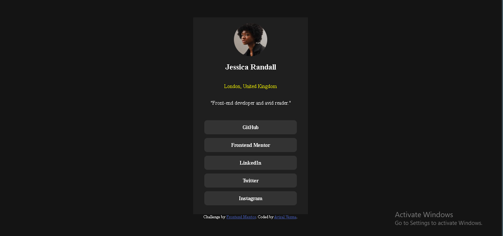

# Frontend Mentor - Social links profile solution

This is a solution to the [Social links profile challenge on Frontend Mentor](https://www.frontendmentor.io/challenges/social-links-profile-UG32l9m6dQ). Frontend Mentor challenges help you improve your coding skills by building realistic projects. 

## Table of contents

- [Frontend Mentor - Social links profile solution](#frontend-mentor---social-links-profile-solution)
  - [Table of contents](#table-of-contents)
  - [Overview](#overview)
    - [Screenshot](#screenshot)
    - [Links](#links)
  - [My process](#my-process)
    - [Built with](#built-with)
    - [What I learned](#what-i-learned)
    - [Continued development](#continued-development)
  - [Author](#author)

## Overview

### Screenshot

### Links

- Solution URL: [Social Links](https://github.com/aviralrabbit1/frontendMentor-solutions/tree/main/social-links-profile-main)
- Live Site URL: [Social Links website](https://aviralrabbit1.github.io/frontendMentor-solutions/social-links-profile-main/)

## My process

### Built with

- Semantic HTML5 markup
- CSS custom properties
- Flexbox
- Mobile-first workflow

### What I learned

Inherent/default padding values for the elements which must be overroidden.

### Continued development

Responsive grid design and items placement in flexbox.

## Author

- Website - [Aviral Verma](https://github.com/aviralrabbit1)
- Frontend Mentor - [@aviralrabbit1](https://www.frontendmentor.io/profile/aviralrabbit1)
